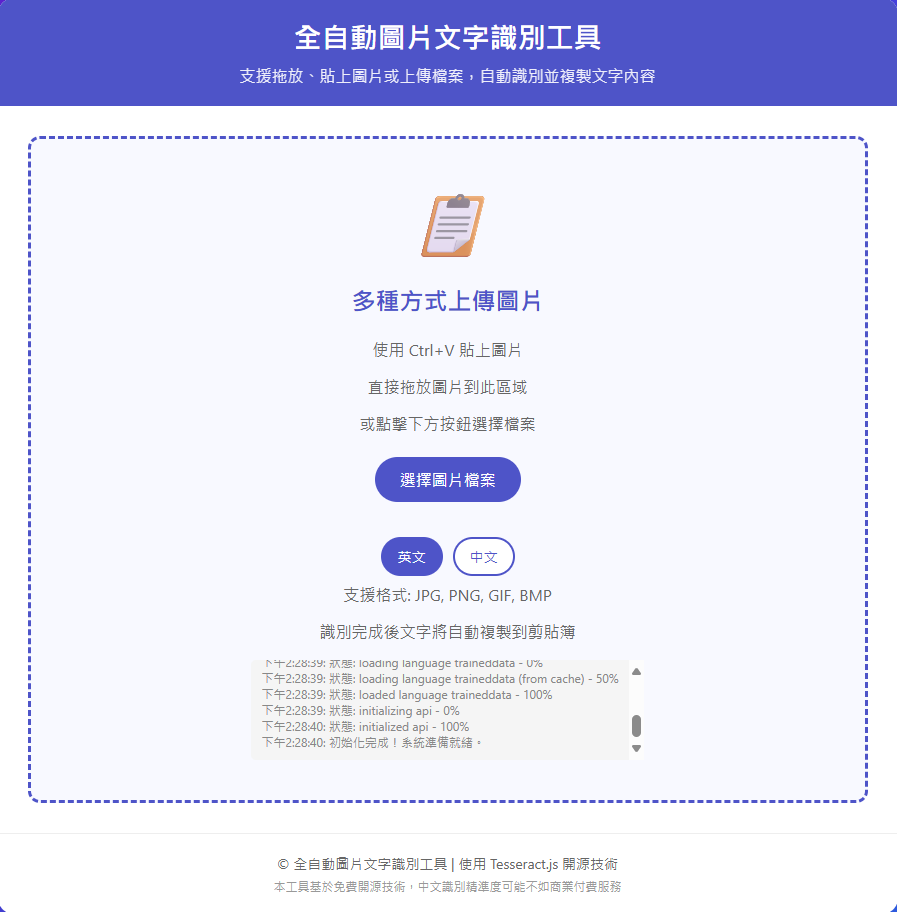

# 全自動圖片文字識別工具 (Auto OCR Web)

📋 一個基於 [Tesseract.js](https://github.com/naptha/tesseract.js) 的瀏覽器端 OCR 工具。  
支援 **拖放 / 貼上 / 上傳圖片**，自動識別圖片中的文字並自動複製到剪貼簿。  

👉 [點此直接使用工具](https://sid-1996.github.io/auto-ocr-web/)

---

## 功能特色
- 支援 **英文、中文 (簡體/繁體)** OCR
- 支援 **拖放圖片 / Ctrl+V 貼上圖片 / 點擊上傳**
- 自動複製識別結果到剪貼簿
- 完全前端運行，無需伺服器
- 即開即用，免安裝

---

## 使用方式
1. 打開 [GitHub Pages 網址](https://sid-1996.github.io/auto-ocr-web/)  
2. 拖放、貼上或上傳圖片  
3. 等待識別完成，文字會自動複製到剪貼簿  

支援格式：JPG、PNG、GIF、BMP  

---

## 技術
- [Tesseract.js](https://github.com/naptha/tesseract.js)
- HTML5 + JavaScript + CSS3

---

## 預覽截圖

---

## 開源授權
本專案採用 [MIT License](LICENSE)
